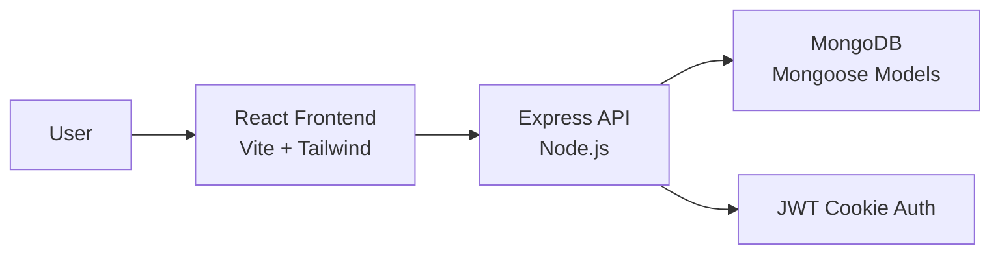

# PakEstate

A modern real-estate marketplace built with React, Express, and MongoDB for browsing, searching, and managing property listings.

## Overview

PakEstate is a property listing platform designed for users who want to discover homes for sale or rent, compare key property details, and manage their own listings through a simple web interface. The project is built for buyers, renters, and property owners who want to list and explore real-estate opportunities in a clean, responsive experience.

The application combines a Vite-based frontend with an Express API and MongoDB database. It supports email/password authentication, listing creation and management, search/filtering, and image URLs stored with listings.

## Features

- User registration and login with email/password
- JWT-based authentication stored in an HTTP-only cookie
- Protected routes for user-specific actions
- User profile page with profile updates and avatar upload
- Create, update, and delete property listings
- Property search and filtering by:
  - search term
  - rent or sale type
  - offer status
  - parking availability
  - furnished status
  - sorting order
- Public listing detail pages with image gallery and listing metadata
- Recent listings sections on the homepage for offers, rent, and sale categories
- Responsive UI built with React and Tailwind CSS
- Image URLs for listing photos and profile avatars
- User ownership checks before allowing listing or account updates/deletes

## Tech Stack

| Category | Technologies |
| --- | --- |
| Frontend | React, Vite, JavaScript, React Router, Tailwind CSS |
| Backend | Node.js, Express |
| Database | MongoDB with Mongoose |
| Authentication | Email/password authentication with JWT cookies |
| File Storage | Public image URLs stored with listings and profiles |
| State Management | Redux Toolkit (installed and structured in the app), plus localStorage for the current user session |
| Styling | Tailwind CSS |
| API Requests | Axios |
| Notifications | React Toastify |
| UI Components | React Icons, Swiper |
| Deployment Config | Vercel config files for frontend and backend |

## Architecture

The project follows a simple client-server architecture:

- The frontend is a React application served by Vite.
- The backend is an Express API that handles authentication, listing operations, and user actions.
- MongoDB stores user and listing records.
- Email/password authentication is handled by the Express API.
- Listing and avatar image URLs are stored in MongoDB; no file-storage provider is required.



## Project Structure

```text
Real-State-Project/
├── Client/
│   ├── public/
│   ├── src/
│   │   ├── Components/
│   │   ├── Pages/
│   │   ├── Redux/
│   │   ├── App.jsx
│   │   ├── main.jsx
│   │   └── index.css
│   ├── .env
│   ├── eslint.config.js
│   ├── index.html
│   ├── package.json
│   ├── vercel.json
│   └── vite.config.js
├── Server/
│   ├── Controllers/
│   ├── MiddleWare/
│   ├── Models/
│   ├── Routes/
│   ├── .env
│   ├── db.js
│   ├── package.json
│   ├── server.js
│   └── vercel.json
├── .gitignore
├── package.json
├── package-lock.json
└── README.md
```

### Folder overview

- Client: frontend application built with React and Vite
- src/Components: reusable UI components such as Header, ListingCard, Contact, Private, and route wrappers
- src/Pages: application pages including Home, SignIn, SignUp, Profile, CreateListing, Listing, UpdateListing, Search, and About
- src/Redux: Redux store and user slice setup
- Server/Controllers: business logic for authentication, users, and listings
- Server/Models: MongoDB schemas for users and listings
- Server/Routes: API endpoints grouped by resource
- Server/MiddleWare: JWT verification middleware
- .env files: local environment configuration for frontend and backend

## Installation & Setup

### 1. Clone the repository

```bash
git clone http://github.com/anwaarulislam111-netizen/Mern-real-estate-project
cd mern-estate
```

### 2. Install dependencies

Install frontend dependencies:

```bash
cd Client
npm install
```

Install backend dependencies:

```bash
cd ../Server
npm install
```

### 3. Environment Variables

This project uses environment variables in both the frontend and backend.

#### Frontend: Client/.env

```env
VITE_BACKEND_URL=http://localhost:8000
```

These variables are used in:

- frontend API calls to the backend (`VITE_BACKEND_URL`)

#### Backend: Server/.env

```env
MONGODB_URL=your_mongodb_connection_string
JWT_SECRET=your_jwt_secret
FRONTEND_URL=http://localhost:5173
PORT=8000
NODE_ENV=development
```

These variables are used in:

- `Server/server.js` for database connection and CORS configuration
- `Server/authController.js` for JWT generation and cookie setup
- `Server/MiddleWare/VerificationMW.js` for token verification
- `Server/db.js` for MongoDB connection

### 4. Run the application

Start the backend:

```bash
cd Server
npm run dev
```

Start the frontend:

```bash
cd Client
npm run dev
```

The frontend typically runs on `http://localhost:5173` and the backend on `http://localhost:8000` unless the environment variables are changed.

## Deploy to Vercel

Deploy the `Client` and `Server` folders as two separate Vercel projects.

### Backend project

- Import the repository and set **Root Directory** to `Server`.
- Vercel will use `server.js` through `Server/vercel.json`.
- Add these environment variables in the Vercel project settings:

```env
MONGODB_URL=your_mongodb_connection_string
JWT_SECRET=your_long_random_secret
FRONTEND_URL=https://your-client-project.vercel.app
NODE_ENV=production
```

Copy the deployed backend URL after the first deployment.

### Frontend project

- Import the same repository as a second Vercel project and set **Root Directory** to `Client`.
- Vercel will run `npm run build` and use `Client/vercel.json` for React Router fallback.
- Add these environment variables in the Vercel project settings:

```env
VITE_BACKEND_URL=https://your-server-project.vercel.app
```

After the frontend deployment, update the backend `FRONTEND_URL` with the final frontend URL and redeploy the backend.

## API Documentation

The backend exposes a REST API under `/api`.

| Method | Endpoint | Description | Authentication |
| --- | --- | --- | --- |
| POST | `/api/auth/signup` | Register a new user | No |
| POST | `/api/auth/signin` | Sign in with email and password | No |
| GET | `/api/auth/signout` | Clear JWT cookie and sign the user out | No |
| GET | `/api/user/:id` | Fetch a single user by ID | No |
| POST | `/api/user/update/:id` | Update user information | Yes |
| POST | `/api/user/delete/:id` | Delete a user account | Yes |
| GET | `/api/user/listings/:id` | Fetch listings belonging to a specific user | Yes |
| POST | `/api/listing/create` | Create a new listing | Yes |
| DELETE | `/api/listing/delete/:id` | Delete a listing | Yes |
| GET | `/api/listing/get/:id` | Fetch a single listing | No |
| POST | `/api/listing/update/:id` | Update a listing | Yes |
| GET | `/api/listing/get` | Fetch listings with search and filter support | No |

### Notes on the listing API

The listing listing endpoint supports query parameters such as:

- `searchTerm`
- `type` (`all`, `rent`, `sale`)
- `offer`
- `parking`
- `furnished`
- `sort`
- `order`
- `limit`
- `startIndex`

These are used by the frontend search page and home page.

## Authentication & Authorization

Authentication is implemented using JWT tokens issued after successful email/password login or Google sign-in.

How it works:

- The server signs a JWT with the user ID.
- The token is stored in an HTTP-only cookie named `token`.
- Protected routes require the JWT verification middleware.
- The verification middleware reads the token from `req.cookies.token`.
- Requests are rejected with `401` if the token is missing or invalid.

Authorization logic in the app is based on ownership checks:

- Users can only update or delete their own profile
- Users can only delete their own listing
- Listing ownership is checked by comparing `req.user.id` with `listing.userRef`

This project does not implement a separate admin role or permission system.

## Image URLs

The application does not use a file-storage provider. Users add public image URLs for listing photos and profile avatars, and those URLs are stored in MongoDB.

## Database

The application uses MongoDB via Mongoose.

### Relationship

- Each listing includes `userRef`, which references the user who created it.
- The app checks this ownership value during updates and deletions.
- User profiles store avatar URLs and account information.

## Security

The project includes several actual security practices:

- Password hashing with `bcrypt`
- JWT authentication using `jsonwebtoken`
- Protected backend routes via verification middleware
- Cookies configured with `httpOnly` and environment-aware `secure`/`sameSite` values
- CORS configuration with a frontend origin whitelist
- Environment variables used for secrets and connection strings
- Ownership checks before profile and listing mutations

The project does not currently appear to implement role-based admin authorization, rate limiting, or advanced input sanitization beyond the built-in validation and server-side checks present in the controllers.

## Error Handling

The application handles errors in both the frontend and backend.

### Backend

The server and controllers return status codes such as:

- `400` for bad requests or validation failures
- `401` for unauthorized access
- `403` for forbidden access when ownership checks fail
- `404` for missing records
- `500` for unexpected server errors

Examples include validation errors during listing creation and missing user/listing checks.

### Frontend

The frontend uses:

- `toast.error` and `toast.success` from `react-toastify`
- component state such as `error`, `loading`, and `uploading`
- fallback handling for failed image uploads and failed API requests
- `Promise.allSettled` on the homepage to keep listing sections resilient even if one request fails

## Deployment

Deployment configuration is present for Vercel:

- `Client/vercel.json` configures the frontend as a static Vite build
- `Server/vercel.json` configures the backend as a Node.js server

This suggests the project is intended to be hosted separately as a frontend and API on Vercel, but no live production URL is specified in the repository.